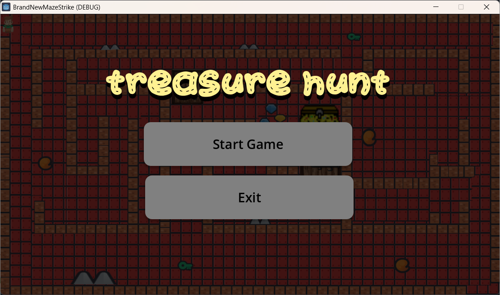
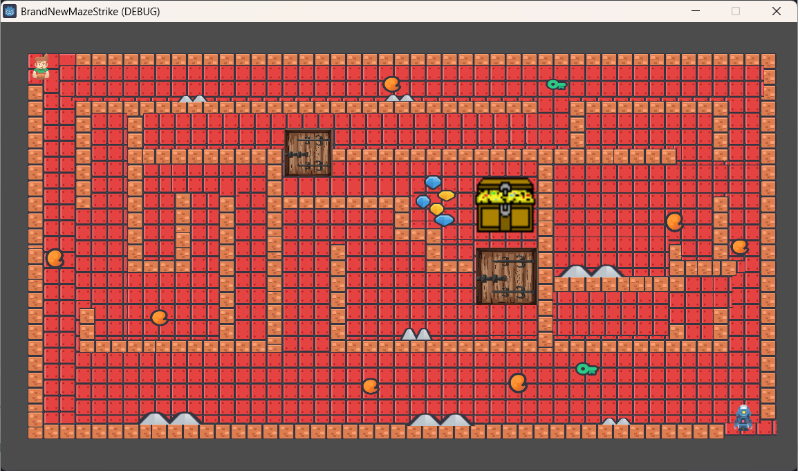

# 🎮 MazeStrike

MazeStrike is an **AI-powered maze navigation game** developed using the **Godot Game Engine**.
The core objective is to guide the player through complex maze environments by leveraging **path-finding algorithms** to determine optimal movement paths and intelligent navigation behavior.

This project demonstrates the practical application of **Artificial Intelligence algorithms in games**, focusing on **graph traversal and path-finding techniques** to solve navigation problems in dynamic environments.

---

## 🧠 AI & Algorithmic Concept

MazeStrike implements **AI-based path finding** to handle maze traversal logic. The maze is modeled as a **grid/graph structure** where:

* Each cell/node represents a potential movement position
* Walls act as blocked nodes
* Paths are computed to determine valid and optimal routes

The AI logic ensures:

* Intelligent decision-making for player movement
* Efficient navigation from start to goal
* Avoidance of dead ends and obstacles

This makes MazeStrike an excellent example of **AI algorithms applied to real-time game scenarios**.

---

## 🧩 Key Features

* AI-based maze path finding
* Intelligent navigation logic
* Challenging maze layouts
* Smooth and responsive player movement
* Interactive level design
* Clean UI and controls
* Built using Godot Engine

---

## 🛠️ Technology Stack

* **Game Engine:** Godot Engine
* **Programming Language:** GDScript
* **AI Concept:** Path Finding / Graph Traversal
* **Platform:** PC

---

## 📸 Game Screenshots

<p align="center">
    
  
</p>

*Screenshots taken directly from in-game gameplay.*

---

## 🎥 Gameplay Demo

▶ **[Watch MazeStrike Gameplay Video](MazeStrikeVideo.mp4)**

This video showcases:

* Maze navigation
* AI-assisted movement behavior
* Level progression and gameplay flow

---

## 📂 Project Structure

```text
MazeStrike/
│── README.md
│── MazeStrikeVideo.mp4
│── Image1.png
│── Image2.png
└── brandnewmazestrike/
    ├── CHARACTERS/        # Player & character assets
    ├── Tiles/             # Maze tiles & environment assets
    ├── Levels/            # Maze level designs
    ├── *.tscn             # Godot scene files
    ├── *.gd               # GDScript logic (AI & movement)
    ├── *.import           # Asset import metadata
    ├── default_env.tres
    └── project.godot      # Godot project configuration
```

---

## ▶️ How to Run the Game

1. Clone the repository:

   ```bash
   git clone https://github.com/krixhnndu/MazeStrike.git
   ```
2. Open **Godot Engine**
3. Click **Import Project**
4. Select the `project.godot` file inside the `brandnewmazestrike` folder
5. Press **▶ Run** to start the game

---

## 🎮 Controls

* **Arrow Keys / WASD** – Player movement
* **Esc** – Exit game

---

## 🎯 Learning Outcomes

* Understanding AI path-finding in games
* Applying graph traversal concepts in real-time systems
* Implementing decision-making logic using GDScript
* Hands-on experience with Godot Engine

---

## 👤 Author

Krishnendu S Binu

---

## 📄 License

This project is developed for educational and demonstration purposes.

---
